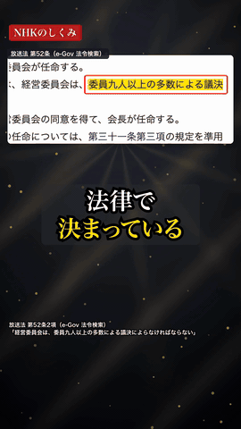

# yukkuri-short-studio

ゆっくりボイスの縦ショート動画を、**台本から Premiere Pro の編集素材まで**、Claude Code を中心に複数の AI で分担して作るためのスキル集です。

- 台本を「1本の軸・高校生でもわかる言葉」で組み立て、事実は一次資料で確かめる
- ゆっくりボイス（AquesTalkPlayer）で行ごとの音声を作り、Whisper で聞き取りまで確かめる
- Premiere Pro でそのまま読み込める FCP7 XML を作る（テロップは打ち替えられる文字クリップ、図・スクショ・人物の絵はナレーションに合わせて動く透明付き動画、出典の注記・マーカー付き）
- BGM と効果音を、曲の波形と場面に合わせて置く
- 複数の AI（Claude Code・Codex・Gemini など）に作業を割り振り、統括の Claude Code が1つの看板ボードで管理する

> ⚠️ 動画そのものの自動書き出しはしません。最後の仕上げは Premiere Pro で行う前提です。

## サンプル：NHK会長は、誰が決めている？（42秒）

`examples/nhk-chairman/` に、このスキル集で作った縦ショート1本分の台本・調べ・作業の記録・設定・スクリプトが入っています。

| 場面 | 画面 | 音 |
|---|---|---|
| 冒頭 | 放送センターの絵が落ちてきて着地、題名が回って出る | BGM（生成）・どすん |
| 条文 | e-Gov の放送法52条に寄る → マーカー → 赤枠 → ハンコ | キラッ・ビシッ・ペタッ |
| 賛成9人 | 12の席が1つずつ点く | 1つごとに音程が上がるピコッ（自作） |
| 山場 | 曲の「ため→ドロップ」に合わせて人物が登場、背景に集中線 | ドロップ |
| 締め | 3段の図（総理大臣 → 経営委員12人 → 会長）と「一票はない」 | 曲の頭の一打で締める（ループでつながる） |



全編（42秒・音あり）：[`examples/nhk-chairman/公開/demo/NHK会長編_v2_完成版_720p.mp4`](examples/nhk-chairman/公開/demo/NHK会長編_v2_完成版_720p.mp4)

> スキルが作った XML を Premiere Pro に読み込み、そのまま書き出したもの（1080×1920 を 720×1280 に縮めて同梱）。

## 仕組み

```
リサーチ → 台本 → ファクトチェック（別モデル） → 台本の確定（人）
   → 音声（ゆっくりボイス・聞き取り確認）
   → 素材（絵：Codex に JS Paint で描かせる／図：Python／条文のスクショ）
   → spec.json → Premiere 用 XML（build_all.py）→ 動く背景（Python）
   → BGM（ライブラリの曲 or ElevenLabs で場面に合わせて生成）・効果音
   → プレビューの点検（別モデル） → Premiere で確認（人）
```

作業は `tasks.json`（状態の正本）と `tasks/<ID>/brief.md`（依頼書）→ `報告.md`（結果）で受け渡します。どの AI でも「brief.md を読んで実行」で動けるので、モデルは交換部品として扱えます。人は看板ボード（`tools/studio/studio.py serve`）で OK・差し戻し・判断・メモ・カードの追加ができます。

## 入っているもの

| 場所 | 中身 |
|---|---|
| `skills/yukkuri-short-studio/` | 全体の流れと分担の決まり（Claude Code のスキル） |
| `skills/yukkuri-voice/` | 台本 → ゆっくりボイスの音声 → 聞き取り確認 |
| `skills/premiere-short-xml/` | 台本・音声・spec.json → Premiere 用 XML・動く図・BGM・効果音 |
| `tools/yukkuri/` | AquesTalkPlayer を呼ぶコマンド `yukkuri`（CLI と ローカル HTTP API） |
| `tools/studio/` | 複数 AI の分担ボード（`studio.py`）と看板ボードの画面 |
| `examples/nhk-chairman/` | サンプル1本分（上の表） |

## 必要なもの

| もの | 用途 | 備考 |
|---|---|---|
| macOS（Apple Silicon） | 全体 | ヒラギノのフォントを使う。聞き取りの確認に使う mlx-whisper は Apple Silicon 専用（Intel の Mac では `yk.py make --no-check` で確認を省く） |
| [Claude Code](https://claude.com/claude-code) | 統括・台本・組み立て | |
| Adobe Premiere Pro 2026 | 仕上げ | XML の読み込みは 2026 で確かめた |
| AquesTalkPlayer | ゆっくりボイス | **各自で公式サイトから入手**（同梱しない）。個人の非営利利用は無料、収益化・業務利用は商用ライセンスが必要 |
| Python 3.11+ と Pillow・numpy・matplotlib | 画像・動き・波形 | |
| ffmpeg・poppler（pdftoppm）・MeCab（IPA 辞書） | 動画・PDF・参考読み | Homebrew で入る |
| mlx-whisper | 聞き取りの確認 | Apple Silicon |
| Codex CLI（任意） | 別モデルの点検・図の作成・絵 | ChatGPT の契約内で動く |
| ElevenLabs（任意・従量課金） | BGM の生成 | 1分あたり約 $0.15（2026-09 時点）。使う前に見積もりを出して承認をもらう決まり |
| browser-use（任意） | 条文などのスクショ | |

## インストール

```bash
git clone <このリポジトリ>
cd yukkuri-short-studio
./install.sh          # ~/.claude/skills にスキルを、~/.local/bin に yukkuri コマンドを入れる
```

`~/.local/bin` が PATH にないときは `echo 'export PATH="$HOME/.local/bin:$PATH"' >> ~/.zshrc` のあと、ターミナルを開き直す。声が出るかの確認：

```bash
yukkuri voices                                   # 声の一覧
yukkuri say -t "テストです" -v marisa -o test.wav   # AquesTalkPlayer で1行作れるか
```

## 使い方

Claude Code で、作りたいテーマを伝えます。

```
「NHK の受信料の割増金」でゆっくりの縦ショートを作りたい
```

`yukkuri-short-studio` スキルが、プロジェクトのフォルダ（`tasks.json`・`AGENTS.md`）を作り、リサーチから順に作業を割り振ります。人の判断が要るところ（台本の確定・絵の確認・Premiere での確認・従量課金の承認）では止まって聞きます。

看板ボード：

```bash
cd <プロジェクトのフォルダ>
python3 <このリポジトリ>/tools/studio/studio.py serve   # http://127.0.0.1:8765/
```

## 権利と規約（2026-09-28 に各公式ページで確認）

| もの | このリポジトリに | 条件 |
|---|---|---|
| コード（`skills/`・`tools/`） | ✅ 同梱 | MIT License（`LICENSE`） |
| サンプルの自作の図・建物の絵・自作の効果音 | ✅ 同梱 | [CC BY 4.0](https://creativecommons.org/licenses/by/4.0/deed.ja)。表示の例：「yukkuri-short-studio サンプル素材（CC BY 4.0）」 |
| サンプルの人物の似顔絵（実在の人物） | ✅ 確認用として同梱 | 再利用・再配布は不可（CC BY の対象外） |
| サンプル動画（MP4・GIF） | ✅ 鑑賞用として同梱 | 再利用・再配布は不可。中の声・BGM・効果音は下の各条件に従う |
| ゆっくりボイス（AquesTalkPlayer の声） | 音声ファイル単体は入れていない（サンプル動画の中だけ） | 個人の非営利利用は無料。収益化・業務利用は「使用ライセンス（商用コンテンツ向け）」が必要（[AquesTalkPlayer](https://www.a-quest.com/products/aquestalkplayer.html)） |
| BGM（ElevenLabs Music で生成） | 曲のファイルは入れていない（動画の中だけ） | 有料プラン（Creator 以上）で生成した曲は、動画への利用と配信ができ表記は不要。曲を音源として第三者に提供する配布は禁止（[Eleven Music の条件](https://elevenlabs.io/eleven-music-model-specific-terms)）。サンプルは Creator プランで生成 |
| 効果音ラボの効果音 | 入れていない（動画の中だけ） | 映像作品への利用は無料・表記不要。音そのものの再配布、音を流して紹介する動画、テンプレートへの組み込みなどは禁止（[規約](https://soundeffect-lab.info/agreement/)） |
| 法令の条文 | e-Gov のスクショは入れていない（`capture_egov.sh` で撮る） | 法令は著作権の対象外（著作権法13条） |

事実について：数字・言葉は一次資料に根拠のあるものだけを使う決まり。サンプルの根拠は `examples/nhk-chairman/research/`（放送法・経営委員会の議事録・NHK の収支予算の抜粋）。

## ライセンス

コードは MIT License（`LICENSE`）。コード以外の素材の扱いは上の「権利と規約」の表のとおり（MIT はコードだけに適用）。
